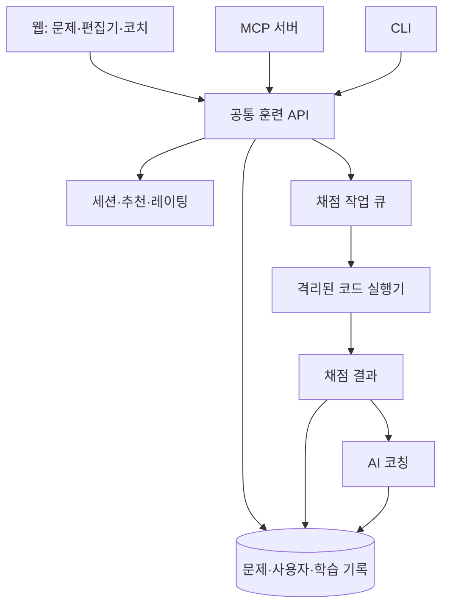

# 함수형 프로그래밍 코딩 훈련 시스템 구현 제안서

- 작성일: 2026-09-29
- 상태: 검토용 초안. Gleam 우선 및 이후 Haskell·다른 언어 추가는 확정 방향이며, 나머지 기술 선택과 수치는 검토 대상이다.
- 원본 요구사항: [plan.md](./plan.md)
- 목적: 다른 에이전트가 대화 이력 없이 교육 효과, 제품 구성, 구현 가능성과 누락 사항을 독립적으로 평가할 수 있도록 한다.

## 1. 제안 요약

핵심 제품은 짧은 문제풀이를 반복하는 개인 맞춤형 함수형 프로그래밍 훈련 시스템이다. 기본 학습 흐름은 다음과 같다.

> 짧게 풀기 → 근거가 있는 피드백 → 직접 수정 → 변형 문제 → 시간이 지난 뒤 다시 풀기

능력별 레이팅은 문제 난이도를 조정하고, 복습 일정은 학습 유지 여부를 확인한다. AI 코치는 실행 결과와 학습 목표를 근거로 다음 수정 행동을 안내한다. 웹, MCP, CLI는 동일한 훈련 엔진과 학습 이력을 사용한다.

첫 버전의 교육 언어는 Gleam으로 확정한다. 이후 Haskell과 다른 언어를 추가한다. 공통 함수형 개념과 언어별 콘텐츠·채점 구현을 분리하되, MVP에서는 Gleam만 구현한다. 기초 문법을 아는 개발자를 대상으로 소수의 핵심 능력에 집중한다는 범위는 여전히 제안이다. 플랫폼 자체의 구현 언어는 별도로 결정한다.

## 2. 원본 요구사항과 제안의 대응

| 원본 요구사항 | 제안 | 검토할 쟁점 |
|---|---|---|
| 함수형 프로그래밍 기반 문제풀이 | 능력별 커리큘럼과 짧은 코드 과제 | 함수형 사고와 특정 문법 숙련을 어떻게 구분할 것인가 |
| MCP/CLI로 외부 AI 플랫폼에서 사용 | 공통 API 위에 MCP·CLI 어댑터 구현 | 대상 클라이언트의 인증·표시·연결 호환성 |
| 짧은 호흡과 점진적 반복/변주 | 복습·집중 훈련·변형 적용으로 세션 구성 | 적절한 문제 길이와 변주의 깊이 |
| 개별/종합 능력 레이팅 기반 추천 | 능력별 레이팅과 복습 상태를 분리 | 적은 데이터에서의 추정 신뢰도 |
| 게임 훈련·매칭 이론 활용 | 배치 평가, 수준별 매칭, 재도전, 종합 과제 | 참여 유도와 실제 학습의 일치 여부 |
| 기본 접힘 상태의 개념 노트 | 문제별 핵심 규칙·예시·실수 요약 | 노트 열람을 어떻게 학습 기록에 반영할 것인가 |
| 사이드 AI 채팅 | 문제·현재 코드·채점 결과를 아는 코치 | 답안 제공과 학습 지원의 균형 |
| 정답 채점과 코드 품질 코칭 | 실행 검사, 과제 요구사항 검사, 루브릭 기반 리뷰 | 객관적 실패와 주관적 개선 의견의 구분 |

## 3. 범위와 가정

### 초기 범위 제안

- 대상: 기본 변수·조건문·함수·배열 문법을 이해하는 개발자.
- 교육 언어: Gleam으로 확정. Gleam을 처음 접하는 사용자를 위한 짧은 문법 안내를 제공.
- 문제 길이: 약 3~7분, 세션 길이: 약 15분을 초기 목표로 설정.
- 콘텐츠: 핵심 능력 3개와 검수한 문제 약 30개로 시작.
- 인터페이스: 웹 훈련 화면과 MCP/CLI 접근 경로를 제공.
- 평가 목적: 개인화와 성장 확인. 초기에는 공개 경쟁 순위를 제공하지 않는다.

### 첫 버전 이후로 미루는 범위

- Haskell 및 다른 언어의 콘텐츠와 실행 환경. 확장 경계는 처음부터 두되 실제 지원은 MVP 이후 추가.
- 검수 없이 즉석 생성되는 문제의 정식 출제.
- 대규모 경쟁 랭킹과 부정행위 판별.
- 복잡한 확률 모델을 사용하는 다차원 능력 추정.
- 대형 프로젝트 전체를 대상으로 하는 자동 평가.

외부 AI 플랫폼과 자체 웹 중 어느 쪽이 주 사용 경로인지는 미정이다. 외부 플랫폼 중심 제품이라면 MCP/CLI의 완성 순서를 앞당길 수 있다.

## 4. 교육 설계

### 4.1 능력 체계

| 단계 | 능력 | 대표 과제 |
|---|---|---|
| 1 | 불변 데이터 다루기 | 중첩된 레코드의 특정 필드만 갱신한 새 값 만들기 |
| 2 | 데이터 변환 | 조건에 맞는 주문을 추출하고 변환 |
| 3 | 함수 분해와 합성 | 긴 처리 함수를 작은 함수로 분해 |
| 4 | 명시적인 실패 처리 | 누락값과 오류를 반환 타입으로 표현 |
| 5 | 부수효과 분리 | 계산 로직에서 저장·네트워크 호출 분리 |

실제 데이터 모델에서는 순수성·불변성 등 관찰 가능한 능력을 분리한다. 위 표의 단계는 학습 순서이며 능력 ID와 일대일 대응할 필요는 없다. 능력 사이에는 선수 관계를 지정한다.

초기에는 불변 데이터 갱신, 데이터 변환, 함수 분해를 중심으로 문제를 제작한다. Gleam의 함수·리스트·레코드·패턴 매칭 문법을 필요한 시점에 안내한다. 특정 API 사용 여부보다 과제 목표와 코드의 명료성을 평가하며, `map` 사용 자체를 보상하지 않는다.

Gleam은 불변 데이터를 제공하지만 일반 함수에서 부수효과를 수행할 수 있다. 따라서 불변성과 순수성을 별도 개념으로 가르치고, 효과 분리는 설계 과제로 다룬다. [Gleam 공식 FAQ](https://gleam.run/frequently-asked-questions/)

### 4.2 한 세션의 흐름

1. 복습: 이전에 학습한 능력을 짧은 문제로 확인.
2. 집중 훈련: 현재 약점 하나에 초점을 맞춘 코드 작성 또는 수정.
3. 피드백과 재제출: 가장 중요한 개선점 1~2개를 직접 수정.
4. 변형 적용: 경계 조건이나 업무 맥락이 달라진 문제 해결.
5. 마무리: 개선된 점과 다음 복습 대상을 안내.

예를 들어 불변 데이터 훈련은 갱신 전후 값 예측 → 일부 필드만 바꾼 레코드 생성 → 중첩 레코드와 리스트로 변주 → 며칠 뒤 새로운 맥락에서 재확인으로 이어진다.

### 4.3 적용할 학습 원리

- 회상 연습: 개념을 먼저 보여주기보다 필요할 때 노트를 펼치게 한다. 문제 유형에 결과 예측과 오류 설명도 포함한다.
- 간격 반복: 초기에는 1일·3일·7일 등 단순한 복습 간격을 사용하고 실제 성공 여부에 따라 조정한다.
- 변주: 값과 변수명뿐 아니라 경계 조건·요구사항·업무 맥락을 바꾼다.
- 점진적 도움 축소: 처음에는 예시와 힌트를 제공하고 이후에는 독립 해결을 확인한다.
- 종합 적용: 단일 능력을 연습한 뒤 여러 능력을 함께 사용하는 과제를 제공한다.

회상 연습의 장기 기억 효과를 뒷받침하는 연구가 있으나, 이 제품의 코딩 과제에서 같은 크기의 효과가 난다는 의미는 아니다. 복습 간격과 세션 구성은 검증할 설계 가설이다. [회상 연습 연구](https://doi.org/10.1016/j.jml.2006.09.004)

### 4.4 게임 훈련에서 가져올 요소

- 배치 평가: 짧은 진단으로 시작 수준 추정.
- 수준별 매칭: 너무 쉽거나 어려운 문제의 연속을 줄임.
- 재도전: 실패 직후 작은 수정으로 다시 시도.
- 개인 기록 비교: 과거의 같은 오류를 해결했는지 표시.
- 종합 도전: 여러 능력을 새 맥락에서 사용하게 함.

보상은 풀이 개수 외에도 약점 개선, 수정 성공, 지연 복습 성공에 부여한다. 연속 접속이나 점수 증가가 학습 성과를 대신하지 않도록 한다.

## 5. 능력 추정과 추천

### 5.1 분리해서 저장할 상태

| 상태 | 용도 |
|---|---|
| 능력별 레이팅 | 문제 난이도 선택 |
| 관측 횟수·추정 신뢰도 | 추가 진단 필요성 판단 |
| 마지막 독립 해결 시점 | 복습 시점 결정 |
| 힌트·노트·해설 사용 이력 | 도움받은 해결의 맥락 기록 |
| 반복 오류 유형 | 다음 집중 훈련 선택 |

종합 레이팅을 표시하더라도 다음 문제 추천에는 능력별 상태를 사용한다. 종합 점수의 산식과 표시 여부는 미정이다.

공통 개념의 능력 정의와 언어별 숙련도 기록을 구분한다. MVP에서는 Gleam에서 관측한 능력만 갱신한다. 이후 새 언어를 추가해도 기존 점수를 그대로 복사하지 않고 짧은 진단으로 시작 수준을 정한다. 컴파일 오류는 문법·타입 이해의 증거로 별도 기록하고, 그 자체를 함수형 개념 전반의 실패로 해석하지 않는다. 언어 간 능력 전이를 추정하는 모델은 후속 과제다.

### 5.2 초기 레이팅 정책

- Elo 형태의 단순한 사용자 능력 대 문제 난이도 모델로 시작하는 안을 제안한다.
- 각 문제에는 주 평가 능력 하나와 선수 능력, 초기 난이도를 지정한다.
- 초기 문제 난이도는 제작자가 설정한다. 충분한 독립 풀이 데이터가 모인 뒤 보정한다.
- 한 문제의 재제출을 서로 독립적인 평가로 취급하지 않는다.
- 연습 중 힌트를 사용했다고 직접 벌점을 부여하지 않는다. 별도의 독립 확인 과제로 숙련도를 갱신하는 방식을 우선 검토한다.
- 적은 관측으로 큰 점수 변화를 확정적으로 보여주지 않는다. 초기에는 잠정 수준임을 표시한다.

구체적인 갱신식, 난이도 보정 기준, 신뢰도 표현은 설계가 필요하다. 특히 사용자와 문제 난이도를 동시에 갱신할 때 추정이 흔들리는 문제를 검토해야 한다.

### 5.3 추천 순서

1. 선택한 언어의 문제 중 선수 능력을 충족하는 문제를 추린다.
2. 복습 예정 능력과 최근 반복 오류를 우선한다.
3. 목표 난이도에 가까운 문제를 선택한다.
4. 최근에 본 문제와 지나치게 유사한 문제는 줄인다.
5. 일정 비율로 새로운 맥락의 적용 문제를 배치한다.

예상 성공률 75~85%는 초기 실험 범위로 제안한다. ‘85% 규칙’ 연구는 특정 이진 분류 학습 조건에서 도출되었으므로 코딩 교육의 보편적 최적값으로 적용할 수 없다. [원 연구](https://www.nature.com/articles/s41467-019-12552-4)

### 5.4 외부 AI 사용에 따른 한계

MCP/CLI 사용자는 외부 AI에서 추가 힌트나 완성 답안을 받을 수 있다. 서버가 이를 완전히 관측하거나 독립 풀이 여부를 보장할 수는 없다. 관측된 도움 사용과 사용자 신고를 기록하되 레이팅을 인증된 실력 점수로 제시하지 않는다. 도움을 줄인 확인 세션과 새로운 전이 과제를 제공하는 방향을 검토한다.

## 6. 채점과 코칭

### 6.1 평가 계층

| 계층 | 평가 내용 | 구현 방향 |
|---|---|---|
| 동작 정확성 | 결과, 경계 조건, 예외 처리 | 공개·비공개 테스트 |
| 과제 요구사항 | 지정 필드 외 값 보존, 허용 모듈 등 명시된 제약 | 실행 검사와 필요한 정적 분석 |
| 코드 품질 | 명명, 분해, 중복, 불필요한 추상화 | 루브릭 기반 AI 리뷰 |

레코드 갱신 시 대상 외 필드가 보존되는지처럼 직접 관측 가능한 성질은 실행 검사로 확인한다. 일반적인 순수성 전체를 제한된 테스트나 AST 검사로 증명할 수 있다고 가정하지 않는다.

정확성 통과와 품질 개선 의견은 별도로 표시한다. 명시되지 않은 스타일 취향 때문에 정답을 오답으로 바꾸지 않는다. AI의 주관적 품질 평가는 초기 핵심 레이팅 갱신에서 제외하는 안을 제안한다.

### 6.2 코치의 응답 구조

1. 현재 결과: 무엇이 통과했고 무엇이 실패했는지.
2. 근거: 관련 코드 위치와 관측된 동작.
3. 우선 개선점: 지금 수정할 항목 1~2개.
4. 다음 행동: 사용자가 직접 시도할 구체적인 질문이나 과제.

예시:

> 변경한 주소는 맞지만, 새 사용자 레코드를 만들면서 기존 이름도 기본값으로 바뀌었습니다. 주소 외 필드는 그대로 유지하도록 수정해보세요.

수정 후 다시 검사해 개선 여부를 확인한다. 동일 제출의 리뷰는 저장하고, 문제·루브릭·모델 설정 버전을 함께 기록한다. 실행 결과와 AI 설명이 충돌하면 실행 근거를 우선하고 설명을 재검토한다.

### 6.3 힌트와 해설

도움의 깊이는 질문 → 개념 힌트 → 접근법 → 부분 코드 → 전체 해설로 조절한다. 사용자가 전체 해설을 요청하면 제공하고, 이후 숙련도 확인에는 새로운 문제를 사용한다.

코치에는 현재 문제, 제출 코드, 학습 목표, 공개 가능한 채점 근거를 전달한다. 비공개 테스트 원문과 모범 답안을 일반 힌트 컨텍스트에 무조건 넣지 않는다. 제출 코드와 주석은 실행·분석 대상 데이터로 취급하고 코치의 지시로 취급하지 않는다.

## 7. 사용자 인터페이스

### 자체 웹

- 문제 설명과 입력·출력 예시.
- 기본 접힘 상태의 개념 노트: 핵심 규칙, 짧은 예시, 흔한 실수.
- 코드 편집기와 실행·제출 기능.
- 사이드 AI 채팅.
- 채점 결과와 개선점, 재제출 흐름.
- 세션 종료 시 능력 변화와 다음 복습 안내.

### MCP와 CLI

외부 플랫폼은 같은 문제와 피드백을 조회하지만 화면 배치는 클라이언트 기능에 따른다. MCP 연결만으로 모든 클라이언트에 접이식 노트나 사이드 채팅이 동일하게 표시된다고 가정하지 않는다.

CLI는 사람이 읽는 출력과 자동화에 필요한 구조화된 출력을 제공하는 방향으로 설계한다. 세 인터페이스는 같은 사용자 계정과 세션 이력을 참조한다.

## 8. 시스템 구조



초기에는 하나의 백엔드에 도메인별 모듈을 두고, 사용자 코드 실행 워커는 별도로 격리한다. 프레임워크·배포 업체·LLM 제공자는 아직 정하지 않는다.

- 공통 API: 인증된 사용자 기준으로 문제, 제출, 세션, 진행 상태를 관리.
- 추천 모듈: 능력 상태와 복습 일정을 바탕으로 다음 문제 선택.
- 채점 워커: 네트워크 차단, 시간·메모리·프로세스 제한, 임시 파일시스템 적용.
- 코칭 모듈: 채점 결과와 루브릭을 받아 피드백 생성.
- 저장소: 관계형 데이터베이스를 기본 후보로 사용.
- 작업 큐: 코드 실행과 코칭 작업의 상태, 실패, 재시도 관리.

채점 상태는 대기·실행 중·성공·사용자 코드 실패·시스템 실패를 구분한다. 시스템 장애는 학습 실패로 기록하지 않는다. 요청 재시도로 제출이나 레이팅이 중복 반영되지 않도록 멱등성을 보장한다. AI 응답이 지연되어도 실행 채점 결과는 먼저 볼 수 있게 한다.

사용자 코드는 신뢰할 수 없는 실행 입력이다. 일반 API 프로세스 안에서 직접 실행하지 않는다. 구체적인 격리 기술과 운영 비용은 배포 설계 시 검토한다.

### 8.1 언어 확장 경계

- 공통 엔진: 계정, 세션, 추천, 복습, 제출·평가 상태를 관리한다.
- 언어별 채점 어댑터: 소스 준비, 컴파일, 테스트 실행, 진단 메시지 변환을 담당한다. 컴파일 실패·테스트 실패·시간 초과·시스템 실패를 공통 결과 형식으로 반환한다.
- 언어별 콘텐츠: 시작 코드, 참조 풀이, 테스트, 힌트, 관용적 코드에 대한 루브릭을 관리한다. 문제의 공통 학습 목표는 공유할 수 있지만 코드를 기계적으로 번역한 문제를 곧바로 동등한 난이도로 취급하지 않는다.
- 언어별 편집 지원: 문법 강조와 컴파일 진단을 연결한다.

MVP에는 Gleam 어댑터 하나만 구현한다. 컴파일러·표준 라이브러리·의존성·실행 타깃 버전을 고정하고 컴파일 단계에도 자원 제한을 적용한다. Gleam의 Erlang/JavaScript 타깃 중 정식 채점 기준은 시제품 검증 후 하나로 정한다. 두 타깃을 동시에 지원할 필요는 없다.

Haskell 추가 시에는 전용 채점 어댑터와 검수한 콘텐츠를 구현하고, 언어 진단을 도입한다. 이후 다른 언어도 같은 경계를 통해 추가한다. 초기부터 범용 플러그인 프레임워크나 다중 언어 실행 인프라 전체를 만들지는 않는다.

## 9. 데이터와 외부 인터페이스

### 9.1 핵심 데이터

| 데이터 | 주요 내용 |
|---|---|
| User | 계정과 인터페이스별 인증 연결 |
| Skill | 공통 개념 또는 언어 고유 능력의 정의와 선수 관계 |
| ExerciseVersion | 언어, 문제군 ID, 문제, 목표 능력, 언어별 난이도, 테스트·루브릭 버전 |
| Session | 선택 언어, 목표, 출제 순서, 진행 상태 |
| Attempt | 코드, 제출 시점, 재제출 관계, 관측된 도움 사용 |
| Evaluation | 컴파일 진단, 실행 결과, 제약 검사, 컴파일러·실행 환경 버전 |
| CoachingFeedback | 개선 의견, 근거, 생성 설정 버전 |
| SkillEstimate | 사용자·능력·언어별 추정치와 관측 정보 |
| ReviewSchedule | 언어별 다음 복습 시점과 복습 결과 |

문제 수정 후에도 이전 제출의 평가 맥락을 재현할 수 있도록 버전을 고정한다. 제출과 학습 이벤트를 보존해 추천 정책을 나중에 다시 평가할 수 있게 한다. 코드 보관 기간과 삭제 정책은 미결정 사항이다.

### 9.2 MCP 도구 초안

| 도구 | 역할 |
|---|---|
| `start_session` | 목표와 시간에 맞춰 세션 시작 |
| `next_exercise` | 세션의 다음 문제 조회 또는 배정 |
| `submit_solution` | 코드 제출, 채점 작업 ID 반환 |
| `get_feedback` | 작업 상태와 채점·코칭 결과 조회 |
| `request_hint` | 단계별 힌트 요청 |
| `get_progress` | 능력별 현황과 복습 상태 조회 |

개념 노트와 문제 설명은 Resources로, 제출 등 동작은 Tools로 제공하는 안을 제안한다. 클라이언트가 Resources를 활용하지 못하는 경우에도 필수 문제 내용은 도구 응답에서 얻을 수 있어야 한다. MCP의 도구·리소스 구분은 공식 문서를 참고하되, 구현 시에는 대상 클라이언트가 지원하는 프로토콜 버전을 확인한다. [Tools](https://modelcontextprotocol.io/specification/2025-11-25/server/tools), [Resources](https://modelcontextprotocol.io/specification/2025-11-25/server/resources)

서버는 도구 인자로 받은 사용자 ID를 그대로 신뢰하지 않고 인증 정보로 접근 주체를 결정한다. 도구 입력·출력 스키마, 오류 형식, 인증 방식은 별도 API 명세에서 확정한다.

`start_session`은 언어를 지정할 수 있도록 설계하고 MVP에서는 `gleam`만 허용한다. 제출의 언어와 실행 환경은 서버가 문제 버전에서 결정해 불일치를 차단한다. 문제·피드백·진행 조회 응답에도 언어를 포함한다.

## 10. 문제 제작과 검증

문제 하나에는 다음 자료가 필요하다.

- 교육 언어, 주 평가 능력, 선수 능력, 해당 언어에서의 초기 난이도.
- 명확한 요구사항과 공개 예시.
- 참조 풀이와 허용 가능한 대안 풀이.
- 공개·비공개 테스트와 경계 조건.
- 흔한 오답 및 테스트가 이를 잡는지에 대한 확인.
- 단계별 힌트와 개념 노트.
- 코드 품질 루브릭.
- 반복용 변형과 새로운 맥락의 적용 문제.

초기에는 검수한 문제군과 변형 템플릿을 사용한다. AI 생성 문제를 정식 출제하려면 요구사항의 모호성, 참조 풀이의 정확성, 테스트의 판별력, 난이도를 먼저 검증해야 한다.

문제 수뿐 아니라 테스트와 힌트, 대안 풀이를 포함한 콘텐츠 제작 비용을 개발 범위에 포함한다.

## 11. 구현 단계

아래 순서는 기능 의존성을 기준으로 한 제안이다. 인력·예산이 정해지지 않았으므로 일정 추정은 포함하지 않는다.

| 단계 | 구현 범위 | 완료 기준 |
|---|---|---|
| 1. 훈련 경로 검증 | Gleam, 소수 예제 문제, 공통 API, 격리 컴파일·채점, 최소 MCP 연결 | 문제 조회부터 제출·결과 확인까지 동작 |
| 2. 코칭 경험 | 웹 편집기, 개념 노트, 힌트, AI 코칭, 재제출, 문제 약 30개 | 피드백을 바탕으로 직접 수정 가능 |
| 3. 개인화 | 능력별 추정, 복습 일정, 다음 문제 추천 | 학습 이력에 따라 출제가 달라짐 |
| 4. 배포 가능한 MVP | MCP·CLI 완성, 계정 동기화, 오류 복구, 운영 관측 | 실제 대상 클라이언트와 웹에서 일관된 이력 사용 |
| 5. MVP 이후 언어 확장 | Haskell 및 다른 언어의 채점 어댑터·콘텐츠·언어 진단 추가 | 언어별 평가와 학습 기록이 분리되고 공통 엔진에서 동작 |

MCP는 1단계에서 호환성을 조기 확인하고 4단계에서 사용 흐름을 완성한다. 외부 AI 플랫폼이 주 채널로 결정되면 CLI와 MCP의 완성도를 웹보다 먼저 높인다.

## 12. 검증과 성공 지표

### 학습 성과

주 지표는 **7일 뒤 처음 보는 유사 문제를 도움 없이 해결하는 비율**로 제안한다. 실제로 관측하거나 사용자가 보고한 도움 사용의 범위를 함께 명시한다.

보조 지표:

- 피드백 후 수정 성공률.
- 같은 오류의 재발률.
- 새로운 맥락의 문제 해결률.
- 복습 참여율과 세션 완료율.
- 힌트 사용 양상과 중도 이탈 지점.

후속 평가에 돌아온 사용자만의 성과와 전체 대상자의 복귀율을 함께 보고해 생존자 편향을 확인한다. 가능하면 동일한 학습 시간의 고정 순서 훈련과 비교한다. 성공 기준 수치와 필요한 표본 크기는 초기 사용 데이터를 바탕으로 정한다.

### 구현 검증

- 참조 풀이와 대표 오답을 사용한 채점 검증.
- Gleam 컴파일 오류와 학습 목표 관련 실패의 구분, 고정된 실행 환경에서의 재현 검증.
- 언어 확장 시 다른 언어의 문제·평가·레이팅이 잘못 섞이지 않는지 검증.
- 무한 루프·과도한 메모리 사용·외부 접근 시도에 대한 실행 제한 검증.
- 동일 제출 재시도 시 중복 반영 방지 검증.
- 사용자 간 제출과 진행 정보 접근 분리 검증.
- 동일 기록에 대한 추천 정책 재현 검증.
- AI 코칭의 잘못된 지적, 근거 없는 설명, 불필요한 답안 노출 평가.
- 대상 MCP 클라이언트와 CLI의 실제 연결·인증·제출 흐름 확인.

### 운영 지표

채점 지연, AI 응답 지연, 시스템 오류율, 세션당 실행·LLM 비용을 측정한다. 허용 가능한 지연과 비용 상한은 예산과 사용자 기대가 정해진 뒤 확정한다.

## 13. 주요 위험과 미결정 사항

| 쟁점 | 현재 제안 | 추가로 결정할 내용 |
|---|---|---|
| 대상 학습자 | 기본 문법을 아는 개발자 | 완전 초보자 또는 숙련자 포함 여부 |
| 교육 언어 확장 | Gleam 우선, 이후 Haskell·다른 언어 추가로 확정 | 추가 시점, 후속 언어 우선순위, 언어별 커리큘럼 |
| 플랫폼 구현 기술 | 교육 언어와 별도로 선택 | 백엔드·프런트엔드 구현 언어와 프레임워크 |
| 주 사용 채널 | 웹·MCP·CLI 공통 엔진 | 웹 우선인지 외부 AI 우선인지 |
| 레이팅 신뢰도 | 개인화 지표로 사용 | 갱신식, 초기값, 신뢰도와 종합 점수 표시 |
| 외부 AI 도움 | 완전 관측 불가를 전제로 설계 | 독립 확인 과제의 운영 방식 |
| AI 코칭 품질 | 테스트 근거와 명시적 루브릭 사용 | 허용 오류율과 품질 검수 방식 |
| 콘텐츠 비용 | 검수한 소규모 문제군부터 시작 | 제작·검수 주체와 확장 속도 |
| 실행 환경 | API와 분리한 격리 워커 | 격리 기술, 동시 실행량, 배포 비용 |
| 학습 효과 | 지연 전이 과제로 확인 | 비교 실험과 목표 개선 폭 |
| 데이터 관리 | 버전과 학습 이벤트 기록 | 코드 보관 기간, 삭제, LLM 전달 범위 |
| 구현 자원 | 단계별 개발 | 인력, 예산, 출시 시점 |

## 14. 다른 에이전트에게 요청할 평가

Gleam 우선 및 이후 Haskell·다른 언어 추가는 사용자가 결정한 방향이다. 이를 전제로 나머지 설계를 검토하되, 해당 방향의 구체적인 위험과 완화책도 제시해 달라. 원본 요구사항에 맞는 더 단순하거나 효과적인 대안이 있으면 제시하고, 연구로 뒷받침되는 사실과 제품 설계자의 가정을 구분해 달라.

### 평가 질문

1. 원본 요구사항 중 누락되거나 과도하게 해석된 내용은 무엇인가?
2. 제안된 학습 루프가 함수형 사고의 전이를 실제로 측정하는가?
3. Elo 기반 능력 추정은 이 데이터에 적합한가? 더 단순한 숙련도 단계 모델이 나은가?
4. 힌트 사용, 재제출, 외부 AI 사용이 레이팅을 왜곡하는 문제를 충분히 다루는가?
5. 간격 반복과 난이도 추천을 분리한 설계가 적절한가?
6. 코드 품질 평가가 스타일 취향으로 흐르지 않도록 하는 기준이 충분한가?
7. MCP/CLI와 자체 웹을 동시에 제공하는 범위와 구현 순서가 적절한가?
8. 코드 실행 격리, 인증, 중복 제출, 장애 복구에 빠진 필수 설계가 있는가?
9. 초기 능력 3개·문제 약 30개로 제품 가설을 검증할 수 있는가?
10. 제안에서 먼저 제거하거나 바꿀 항목 세 가지는 무엇인가?
11. Gleam에 맞게 과제가 설계됐는가? 이후 Haskell·다른 언어를 추가할 경계가 충분하면서도 과도한 추상화를 피하고 있는가?

### 권장 평가 결과 형식

1. 총평: 채택 / 수정 후 채택 / 재설계 중 하나와 근거.
2. 장점: 유지할 설계와 이유.
3. 문제점: 심각도, 해당 절, 구체적 실패 시나리오, 개선안.
4. 대안: 복잡도·비용·학습 효과·검증 가능성의 비교.
5. 최소 MVP: 꼭 필요한 범위와 미룰 범위.
6. 검증 계획: 가장 불확실한 가정 세 가지와 확인 방법.
7. 사용자 결정이 필요한 질문.

### 전달용 프롬프트

```text
plan.md와 proposal.md를 읽고 함수형 프로그래밍 코딩 훈련 시스템 제안을
독립적으로 평가하라. 구현이나 파일 수정은 하지 말고 검토 결과를 작성하라.

교육 언어는 Gleam으로 시작하고 이후 Haskell 및 다른 언어를 추가한다는
사용자 결정을 전제로 평가하라. 플랫폼 구현 언어는 별도 미결정 사항이다.

원본 요구사항, 제안자의 가정, 연구 근거를 구분하라. 교육 효과, 능력 추정,
코드 채점과 AI 코칭의 신뢰성, MCP/CLI와 웹 구성, 구현 비용과 운영 위험을
검토하라. 숫자나 알고리즘을 근거 없이 확정하지 말고, 더 단순한 대안과
각 대안의 단점을 함께 제시하라.

proposal.md 14절의 평가 질문을 참고하고 권장 결과 형식으로 답하라.
가장 먼저 바꿔야 할 세 가지와 실제로 검증 가능한 최소 MVP를 명시하라.
외부 근거를 사용하면 출처를 표시하고, 확인하지 못한 사항은 구분하라.
```
